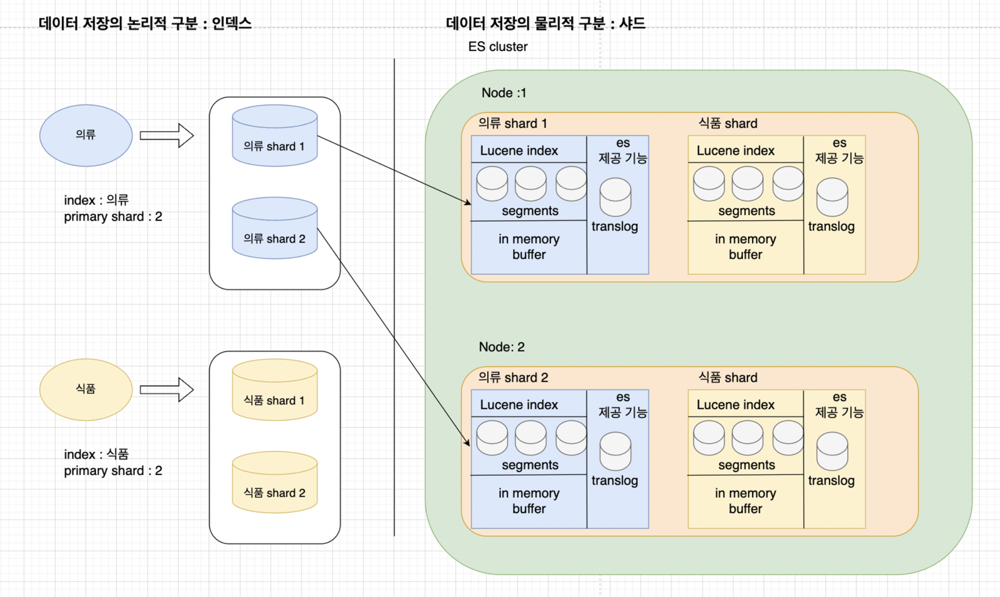

# 엘라스틱 서치 내부 구조 보기

# 목차

1. [소개](#소개)
    1. [이 글에서 소개할 Elasticsearch](#이-글에서-소개할-elasticsearch)
    2. [루씬 소개하기](#루씬-소개하기)
    3. [이 글에서 소개할 Lucene](#이-글에서-소개할-lucene)


2. [엘라스틱서치 구성요소 보기](#엘라스틱서치-구성요소-보기)
    1. [Lucene과 엘라스틱서치의 관계](#lucene과-elasticsearch의-관계)

    2. [엘라스틱서치 주요 용어 보기](#엘라스틱서치-주요-용어-보기)
        1. [논리적 구조로의 ES](#논리적-구조로의-es)
        2. [물리적 구조로의 ES](#물리적-구조로의-es)

    3. [Elasticsearch 의 노드 별 역할](#elasticsearch-의-노드-별-역할)
        1. [노드가 수행 가능한 역할](#노드가-수행-가능한-역할)
        2. [언제 역할을 나누어야 하는가](#언제-역할을-나누어야-하는가)
        3. [split brain 문제](#split-brain-문제)


3. [루씬](#lucene)


4. [루씬 연산 자세히 보기](#)
   1. [루씬 살펴보기 - 쓰기 연산](#루씬-살펴보기---쓰기-연산)
      1. [순서 1. 요청수신](#순서-1-요청수신)
      2. [순서 2. Flush](#순서-2-flush)
      3. [순서 3. Merge](#순서-3-merge)
      4. [순서 4. Commit](#순서-4-commit)
   2. [루씬 살펴보기 - 읽기 연산](#루씬-살펴보기---읽기-연산)
      1. [읽기에서의 퍼포먼스 고려사항](#읽기에서의-퍼포먼스-고려사항-)


5. [루씬 코드 살펴보기](#루씬-코드-살펴보기)
   1. [주요 코드 부분](#주요-코드-부분)

6. [루씬 읽기-코드-자세히-보기](#읽기-코드-자세히-보기-)
      1. [SegmentReader.java 자세히 보기](#segmentreaderjava-자세히-보기)
      2. [SegmentReader 생성 시점](#segmentreader-생성-시점)
         

7. [루씬 쓰기 연산 코드 보기](#)
   1. [Upsert API 호출](#upsert-api-호출-)
      1. [1. indexWriter 에 문서 upsert](#1-indexwriter-에-문서-upsert)
      2. [indexingChain 과 FieldWriter](#indexingchain-과--fieldwriter-)
   2. [Flush 가 수행 될 때](#flush-가-수행-될-때)
 
# 소개

이 문서는 엘라스틱서치(Elasticsearch)와 루씬(Lucene)의 내부 구조와 동작에 대해 다룹니다.

엘라스틱서치의 구조와 분산 처리를 위한 아키텍처를 거시적인 관점에서 설명합니다. 그리고 루씬의 인덱싱과 쿼리 수행 과정을 도식화하여 설명합니다.

루씬의 읽기, 쓰기에 대한 매커니즘을 루씬 코드와 함께 확인해봅니다.

## 이 글에서 소개할 Elasticsearch


위의 이미지는 엘라스틱 서치의 구조를 도식화한 것입니다.

[아래의 엘라스틱서치 구성요소보기](#)에서 각 항목의 역할과 구성의 이유에 대해서 알아봅니다.

## 루씬 소개하기.


루씬 보러가기: [루씬 오픈소스 링크](https://github.com/apache/lucene)

이 글을 읽는 대부분의 독자들은 엘라스틱서치(Elasticsearch)에 대해 알고 있을 것입니다. 그러나 루씬(Lucene)에 대해서는 생소하거나 "그게 엘라스틱서치와 무슨 관계인가요?"라고 생각하는 독자들도 있을 수 있습니다. 이에 대해 간단히 소개하고자 합니다.

루씬은 엘라스틱서치의 연산을 실제로 수행하는 검색 라이브러리입니다. 초기 엘라스틱서치는 루씬을 분산 환경에서 접근할 수 있는 인터페이스 역할을 하는 애플리케이션에 불과했습니다. 지금은 키바나(Kibana)나 머신러닝(ML) 등 다양한 생태계를 이루고 있지만, 구조적으로는 여전히 루씬이 실제 검색 연산을 수행하며 사용자는 엘라스틱서치를 통해 이 연산을 요청하고 결과를 조회하는 매커니즘은 동일합니다.

"그렇다면 ES를 쓰려면 이 복잡해 보이는, 문서도 많지 않은 루씬을 꼭 봐야 하나요?"

상황에 따라 다릅니다!

퍼포먼스 튜닝이나 최신 세미나를 보며 루씬의 매커니즘이나 데이터 저장의 물리적 구조에 대해 언급하는 문서를 이해하려면 이 문서의 정보가 도움이 될 수 있습니다. 또는 테라바이트 단위 이상의 로그 검색 시스템이나 억 단위 이상의 상품 데이터를 검색하는 시스템을 구현하려는 경우, 이 구조와 내용을 알면 퍼포먼스 측면에서 많은 비용을 절감할 수 있습니다.

또한 엘라스틱서치 클라이언트를 이용한 API 개발, 특히 테스트가 실패하는 경우, 왜 트랜잭션이 보장되지 않는지, `flush_immediate` 옵션을 주어도 다음 조회에서 데이터 조회가 보장되지 않는지 등의 운영상의 궁금증을 해결하는 데도 도움이 됩니다.

만약 데이터가 적고, 오타 교정이나 자동 완성 등의 작은 기능을 구현하려는 경우라면 루씬에 대한 내용은 패스해도 괜찮습니다.

## 이 글에서 소개할 Lucene


Apache Lucene 4 : lucene’s
architecture  ( https://www.semanticscholar.org/paper/Apache-Lucene-4-Białecki-Muir/2795d9d165607b5ad6d8b9718373b82e55f41606)


[아래의 루씬 챕터](#lucene)에서 루씬의 읽기, 쓰기 메커니즘과 이미지의 DocumentWriter, IndexReader, IndexWriter, Segment가 어떤 의미인지 집중적으로 설명합니다.


# 엘라스틱서치 구성요소 보기

## Lucene과 Elasticsearch의 관계

엘라스틱서치가 실제로 데이터를 저장하고 조회할 때는 루씬의 기능을 사용하여 디스크에 접근합니다. 위 이미지의 오른쪽에서 보면 엘라스틱서치의 물리적 구분에서 하나의 샤드(shard)가 각각의 루씬 인스턴스에 해당합니다.

## 엘라스틱서치 주요 용어


이 장에서는 엘라스틱서치의 구성과 용어에 대해 알아봅니다.

위 이미지는 엘라스틱서치를 잘 설명하기 위해 "논리적 요소"와 "물리적 요소"로 구분하여 설명하고 있습니다.

기본적으로 엘라스틱서치는 분산을 염두에 두고 설계되어 있기 때문에 별도의 설정 없이 데이터를 저장해도 같은 인덱스에 저장되는 데이터가 물리적으로는 다른 노드에 저장될 수 있습니다. 그래서 Kibana나 ES Head 같은 엘라스틱서치 관리 프로그램에서 유저가 명령을 내리는 단위를 논리적 요소라고 하며, 아래의 요소가 포함됩니다.

**논리적 요소**

| 요소 | 설명 |
|------|------|
| 클러스터 | 공통으로 관리되는 ES 노드의 집합 |
| 인덱스 | 데이터가 저장되고 쿼리가 검색되는 단위로, RDBMS의 테이블에 해당 |

**물리적 요소**

| 요소 | 설명 |
|------|------|
| 샤드 | 인덱스가 나뉘어 데이터가 저장되는 단위로, 각각의 샤드가 루씬 인스턴스 |
| 세그먼트 | 인덱스의 데이터가 저장되는 파일 종류로, 루씬에 의해 읽기/쓰기 관리가 되며 doc_value, inverted_index 등의 자료형이 압축되어 저장 |


## 엘라스틱서치 주요 용어 보기



이 장에서는 엘라스틱서치의 구성과 용어에 대해 알아봅니다. 위의 이미지는 엘라스틱서치를 "논리적 요소"와 "물리적 요소"로 나누어 설명하고 있습니다.

기본적으로 엘라스틱서치는 분산 환경을 염두에 두고 설계되어 있어, 별도의 설정 없이도 데이터를 저장하면 같은 테이블(인덱스)에 저장되는 데이터가 물리적으로 다른 노드에 저장될 수 있습니다.

따라서, Kibana나 ES Head 같은 엘라스틱서치 관리 도구를 통해 사용자가 명령을 내리는 단위를 논리적 요소라고 하며, 아래의 요소가 포함됩니다:


### 논리적 구조로의 ES

| 구성 요소        | 설명                                                                                                                                                                        |
|--------------|---------------------------------------------------------------------------------------------------------------------------------------------------------------------------|
| **노드**       | Elasticsearch가 실행되는 서버 또는 가상 머신을 의미합니다. 각각의 노드는 클러스터에 속하여 데이터를 저장하고 검색 작업을 수행합니다.                                                                                         |
| **클러스터**     | Elasticsearch를 운영하는 단위입니다. 여러 개의 Elasticsearch 인스턴스로 구성되며, 하나의 클러스터 내에서 데이터를 분산 저장하고 검색할 수 있습니다. `elasticsearch.yml` 파일의 호스트 설정을 통해 클러스터에 포함될 노드를 지정할 수 있습니다.             |
| **인덱스**      | Elasticsearch에서 검색이 수행되는 논리적인 범위입니다. 이는 관계형 데이터베이스의 테이블에 해당합니다. 인덱스는 여러 개의 샤드로 나뉘며, 각 샤드에 데이터가 물리적으로 저장됩니다. 인덱스를 생성할 때 몇 개의 프라이머리 샤드(primary shard)를 사용할지 지정해야 합니다.       |
| **샤드**       | 인덱스의 데이터를 실제로 저장하는 물리적인 단위입니다. 각 샤드는 Lucene 인스턴스를 가지고 있으며, 실제 데이터 접근 연산은 이 Lucene의 기능을 통해 수행됩니다. 인덱스가 생성될 때 샤드는 클러스터 내의 각 노드에 분산되어 생성됩니다.                                 |
| **프라이머리 샤드** | 데이터의 원본을 저장합니다. 가능하면 프라이머리 샤드는 클러스터 내의 노드들에 분산되어 생성됩니다. 예를 들어, 4개의 노드가 있는 클러스터에서 4개의 프라이머리 샤드를 가진 인덱스가 생성된다면, 각 노드가 하나씩의 프라이머리 샤드를 가지게 됩니다.                               |
| **래플리카 샤드**  | 조회 성능을 향상시키기 위해 프라이머리 샤드의 복제본을 제공합니다. 래플리카 샤드의 수가 너무 적으면 조회 성능이 떨어지고, 너무 많으면 업데이트 성능이 저하됩니다. 초기 서비스 단계에서는 보통 래플리카 샤드를 1개로 설정해도 충분합니다. 래플리카 샤드는 프라이머리 샤드와 다른 노드에 위치해야 합니다. |
| **도큐먼트**     | Elasticsearch에서 저장되는 각각의 데이터를 의미합니다. 이는 관계형 데이터베이스의 행(row)에 해당합니다.                                                                                                        |

### 물리적 구조로의 ES

| 구성 요소       | 설명                                                                                                                                              |
|-------------|-------------------------------------------------------------------------------------------------------------------------------------------------|
| **샤드**      | 인덱스의 데이터를 실제로 저장하는 물리적인 단위입니다. 각 샤드는 Lucene 인스턴스를 가지고 있으며, 세그먼트로 구성되어 있습니다.                                                                     |
| **세그먼트**    | 샤드가 데이터를 저장하는 단위입니다. 샤드 내에 여러 세그먼트가 존재할 수 있습니다. 세그먼트를 조회하거나 쓰는 과정은 최적화를 위해 직관적으로 동작하지 않으며, 이로 인해 트랜잭션도 보장되지 않습니다.                               |
| **인메모리 버퍼** | 디스크의 파일이나 램 위의 임시 파일로 저장하기 전에 JVM의 힙 메모리에서 데이터를 보관하는 상태입니다. Elasticsearch는 업데이트 요청(upsert)을 주기적으로 일괄 처리하기 때문에 메모리 내에 요청 데이터를 잠시 보관하는 시점이 존재합니다. |
| **트랜스로그**   | 데이터 변경 작업을 기록하는 로그 파일입니다. 이는 데이터의 내구성(durability)을 보장하기 위해 사용되며, 시스템 장애 발생 시 데이터를 복구하는 데 도움이 됩니다.                                               |

## Elasticsearch 의 노드 별 역할

### 노드가 수행 가능한 역할


Elasticsearch는 처리 역할별로 각 노드를 dedicated하게 나눌 수 있습니다. 각 노드의 역할은 다음과 같습니다:

| 구성 요소               | 역할                                                                                                         | 
|---------------------|------------------------------------------------------------------------------------------------------------|
| **Master Node**     | 1. 클러스터와 노드의 메타데이터를 관리합니다. <br/> 2. Split brain 문제를 방지하기 위해 production 환경에서는 최소 3대의 마스터 노드를 운영하는 것이 권장됩니다. |
| **Ingest Node**     | 1. 데이터가 인입될 때 전처리를 담당합니다. <br/> 2. Kibana에서 Ingest Pipeline을 작성하면 해당 스크립트는 이 Ingest Node에서 수행됩니다.          |
| **Data Node**       | 1. 실제 Lucene 연산이 수행되는 장소입니다. <br/> 2. 실제 데이터는 /data/indices 하위 폴더에 segment 형태로 저장됩니다. (압축된거라 사람이 읽을 순 없어요) |
| **Coordinate Node** | 1. 요청을 받는 API endpoint 역할을 합니다. <br/> 2. 부하 테스트 시 CPU 로드가 낮게 나타날 수 있는데, 이는 정상적인 현상입니다.                     |

[이미지 생략 case 1: 역할별로 나뉜 클러스터]

[이미지 생략 case 2: 그냥 덩어리 클러스터]


Elasticsearch는 하나의 노드가 여러 역할을 수행할 수 있습니다. 즉, 노드 하나로 배포하여 위의 네 가지 역할을 모두 수행하게 할 수 있습니다. Elasticsearch의 기본 설정은 노드 하나가 전체 역할을 수행하는 것이므로, 별도의 설정 없이도 ES를 실행시키면 필요한 모든 기능을 수행할 수 있습니다.

### 언제 역할을 나누어야 하는가

퍼포먼스가 매우 중요하거나 모니터링을 철저히 할 준비가 되어 있지 않다면, 역할별로 전담 노드를 사용하지 않고 기본 설정대로 노드의 수만 늘려서 사용하는 것을 추천합니다. 왜냐하면 병목은 거의 항상 데이터 노드에서 발생하기 때문입니다. 데이터 노드의 수를 줄이는 것은 클러스터의 전체 처리 능력을 감소시킬 뿐입니다.

역할을 나누어야 하는 경우는 크게 두 가지입니다:

1. **Ingest Pipeline에서 부하가 큰 연산을 하는 경우**: 예를 들어, 벡터와 전처리에 많은 컴퓨팅 파워를 사용하고 있다면 데이터 노드가 아니라 Ingest Pipeline이 병목이 될 수 있습니다. 이 경우 Ingest Pipeline 노드를 전담하고 해당 노드의 수를 늘리는 것이 퍼포먼스 관점에서 도움이 될 수 있습니다.


2. **마스터 노드를 별도로 운영하고 싶은 경우**: 마스터 노드는 성능이 좋지 않은 컴퓨터를 사용해도 되지만, 수가 중요합니다. 이 경우, 마스터 노드를 별도의 사양으로 설정하여 운영할 수 있습니다.

### Split Brain 문제

[이미지 생략]

Split Brain 문제는 분산 서비스에서 공통적으로 발생하는 문제입니다. 클러스터에 속한 여러 노드를 제어하고 메타데이터를 관리하는 인스턴스는 최소 3개가 필요합니다. 이유는 다음과 같습니다:

1. master 노드가 한개인 경우 : master 노드가 다운되면 전체 클러스터가 다운됨.
2. master 노드가 두개인 경우 :두 마스터 노드가 통신이 안 되면, 각 마스터 노드는 독자적으로 클러스터를 관리하려고 시도하게 됩니다. 하나의 데이터 노드에 두개의 마스터가 각각 샤드나 인덱스 생성 요청을
   보낸다하는 등의 회복 어려운 문제를 야기한다.
3. master 노드가 세개인 경우 : 세 마스터 노드 중 하나가 다운되더라도, 나머지 두 노드가 합의하여 새로운 프라이머리 마스터를 선출할 수 있습니다. 이렇게 하면 클러스터의 연속성과 안정성을 보장할 수
   있습니다. 다수결을 통해 클러스터의 상태를 결정할 수 있기 때문에 split brain 문제를 방지할 수 있습니다.

# lucene


Apache Lucene 4 : lucene’s
architecture  ( https://www.semanticscholar.org/paper/Apache-Lucene-4-Białecki-Muir/2795d9d165607b5ad6d8b9718373b82e55f41606)

위 이미지는 "lucene’s architecture"라는 논문에서 제시된 Lucene의 내부구조를 도식화한 이미지입니다. Lucene 4의 아키텍처를 기반으로 하지만 IndexWriter, IndexReader,
Segment, SegmentReader 등 주요 클래스와 연관관계 구조는 동일합니다.
최근에는 벡터 자료형을 다루는 API나 자료형이 추가되었고 쓰레드 단위의 최적화가 적용되었지만 주요 구현체의 역할과 클래스명은 동일합니다.

이 챕터에서는 위 도식화 중 텍스트 분석을 제외한 세그먼트와 세그먼트에 접근하는 매커니즘에 대해 설명합니다.

Lucene은 최적화를 위해 트랜잭션을 보장하지 않습니다. 요청을 수신하고, 요청이 자바 변수(SegmentReader)에 매핑되는 과정을 최적화를 위해 배치로 일괄 처리하며, 이 세그먼트를 디스크에 반영하는 것도
최적화를 위해 일괄적으로 배치 처리합니다.

Lucene의 동작 매커니즘은 다음과 같습니다:

1. **요청 수신**: Lucene은 인덱싱 요청을 수신합니다.
2. **자바 변수 매핑**: 요청이 자바 변수(SegmentReader)에 매핑됩니다.
3. **일괄 처리**: 이 과정을 최적화를 위해 배치로 일괄 처리합니다.
4. **디스크 반영**: 세그먼트를 디스크에 일괄적으로 배치 처리하여 반영합니다.

이러한 과정을 통해 Lucene은 인덱싱과 읽기 작업을 효율적으로 수행합니다.

만약 코드를 바로 보고 싶다면 [루씬 코드보기](#읽기-코드-자세히-보기-) 파트를 참고해주세요.

# 연산 자세히 보기

## 루씬 살펴보기 - 쓰기 연산

루씬에서의 문서를 Insert 혹은 Update 하는 것은 indexing 이라 합니다. 루씬은 성능 최적화를 위해 메모리에 업데이트 내역을 쌓아 두었다가 주기적으로 segment 를 생성,
병합하는 과정을 가집니다. 이 과정에서 Flush, Merge 등 내부적인 동작과정 대해 살펴봅니다.

해당 과정을 알아 두는 것은 두가지 측면에서 중요합니다.

1. **코드 읽기** : 루씬의 코드는 write 이런 일반적인 단어를 쓰지 않습니다. 아래 챕터에 코드를 보면서 설명한 부분이 있는데, readCommit() 라던가, finishGetReaderMerge()
   등의 자체적인 메커니즘에 쓰이는 용어로 클래스나 메소드명이 작성이 되어 있기 때문에 전반적인 메커니즘을 알아야 코드를 찾아갈수가 있어요.


2. **세미나, 아티클 보기** : Segment 나 merge 로 데이터 일괄 처리하는 것은 퍼포먼스 관련한 아티클에 언급이 종종 되는 내용입니다. 이번 elasticsearch 8(lucene 9) 버전에서도
   Segment 를 읽는 매커니즘이 조금 바뀌어서 발표가 있었는데, 보통 이런 글이나 세미나 들은 배경 설명은 스킵을 하고 가는 경우가 많습니다. 여기서 한번 둘러보시면 다음에 그런 세미나나 퍼포먼스 관련한 내용을
   더 잘 이해할 수 있을겁니다.


### 순서 1. 요청수신


루씬의 기본적인 쓰기 API는 `IndexWriter`입니다. `IndexWriter::addDocuments` 등으로 데이터 저장 요청이 들어오면 아래와 같이 수행됩니다.

문서의 삽입 요청이 들어오면, 루씬은 해당 요청의 정보를 메모리에 저장합니다. Segment에 기록되지 않았기 때문에 해당 정보는 검색되지 않습니다. 이는 아래 이미지에서 in-memory buffer에 해당하며, 아래의 코드 링크를 참고하면 버퍼 자료형과 저장 과정을 확인할 수 있습니다.

해당 작업을 코드로 확인하려면 [요청 수신 코드 정리 보기](#읽기-코드-자세히-보기-) 링크를 참고해주세요.

### 순서 2. Flush


메모리에 쌓아두었던 변경사항을 주기적으로 새로운 segment로 만드는 과정을 Flush라고 합니다. segment로 변경 후에는 메모리에 저장된 요청사항을 삭제합니다.

위의 이미지에서 `new_seg`라고 표현되는 부분이고, 세그먼트에서 검색은 가능하지만 아직까지는 새로 들어온 데이터가 램에만 있고 디스크에는 저장되지 않은 상태입니다.

루씬은 성능을 위해 segment 파일을 만들 때 램에 가상 파일만 만들고 디스크에 반영하지 않습니다. 이후에 설명할 commit 단계에서 실제 데이터를 디스크에 저장합니다.

[위의 요청 수신](#순서-1-요청수신)과는 별도의 쓰레드에서 일어나는 작업입니다. 즉, `IndexWriter::addDocuments`가 정상적으로 반환되었어도 새로운 segment가 생성되었는지는 보장할 수 없습니다.

해당 작업을 코드로 확인하려면 [flush 코드 정리 보기](#쓰기-연산-코드-보기) 링크를 참고해주세요.

### 순서 3. Merge


Segment는 각각의 파일로 관리됩니다. Segment의 갯수가 많아지면 읽어야 하는 파일의 수가 많아지고, 성능 저하의 원인이 될 수 있습니다. 이를 방지하기 위해 루씬은 주기적으로 segment를 병합하여 하나의 segment로 만듭니다. merge 단계 이후에는 반드시 commit이 수행됩니다.

### 순서 4. Commit

디스크에 Segment를 반영하는 단계입니다. 이 과정은 주기적으로 실행되거나 merge 이후에 수행됩니다. Flush 단계까지는 세그먼트가 디스크에 반영되지 않았습니다. merge를 통해 새로 통합된 segment를 디스크에 반영하는 과정이 Commit 과정입니다. 이는 flush의 과정과는 다르게, 실제 디스크에 저장하는 방법입니다.

## 루씬 살펴보기 - 읽기 연산

읽기 연산은 쓰기 연산보다 상대적으로 간단합니다. 특이한 점은 Segment에 대한 정보를 Reader 객체가 초기화될 때 모두 멤버 변수로 가지고 있다가, 조회 요청이 오면 멤버 변수를 클론하여 반환한다는 것입니다. 이 방법은 실시간성을 포기했지만, 힙에 있는 멤버 변수에 접근하는 수준으로 디스크 조회를 대체할 수 있게 합니다.

루씬을 사용하면 `IndexReader`라는 추상 클래스의 구현체로 데이터 읽기를 요청하게 됩니다. `IndexReader`는 멤버 변수로 `SegmentReader`를 가지고 있는데, `SegmentReader`는 멤버 변수로 Segment에 관련한 모든 데이터 정보를 가지고 있습니다.

**Segment 정보 초기화**

다음 두 가지 경우에 Segment 정보를 초기화합니다:

1. `SegmentReader` 객체가 초기화되는 경우
2. `Merge`가 수행된 이후

결국 루씬에서 인덱스에 대한 조회 요청은 JVM 변수로서 관리되는 어떤 멤버 변수를 조회하는 것으로 디스크 접근을 대신할 수 있기 때문에 조회 성능이 우수합니다.


정확한 코드와 초기화 시점은 아래 링크에서 확인할 수 있습니다: [루씬 읽기 코드 살펴보기](#읽기-코드-자세히-보기-)

### 읽기에서의 퍼포먼스 고려사항 

위의 설명과 이전 [ES의 문서 유사도 매커니즘](https://github.com/dkGithup2022/es_search_concept_of_search_technique)을 읽은 독자는 이런 질문을 할 수도 있습니다.

"그럼 이거 느려질 구석이 아예 없는거 아닌가? 검색에 대한 시간 복잡도는 O(검색어 길이)이고, 그마저도 디스크 접근이 없으면 모든 경우에서 요청을 빠르게 처리해야 하는 게 아닌가?"

라는 질문을 떠올릴 수 있습니다. 반은 맞고 반은 틀린 말인데, ES 텍스트 검색 퍼포먼스는 주로 하드웨어의 영향을 받습니다.


What is Lucene? Adrien Grand의 세미나에서 발췌한 이미지입니다.

꽤나 오래된 세미나이긴 하지만, 병목점은 현대와 동일합니다.

인덱스에 속하는 세그먼트 정보의 크기가 커질수록 세그먼트를 램으로 올리는 비용 때문에 성능이 저하될 수 있습니다.

즉, 어지간히 비효율적인 쿼리를 던지는 게 아니라면 문서 수 증가로 인한 하드웨어적인 제약 때문에 성능이 저하되는 것만 주의하면 됩니다.

또한, 여기서 알 수 있는 인사이트는, ES의 조회 성능이 저하된다면 primary shard의 갯수를 node 수만큼 증가시키는 것으로 성능 확보를 기대해볼 수 있다는 점입니다.

# 루씬 코드 살펴보기

이 챕터는 이 글이나 다른 글에서 개념적인 내용을 듣고 "음, 내가 이건 실제로 코드를 봐야 믿을 수 있다"라는 호승심이 있는 독자들을 위한 것입니다. 

사실 이 부분을 안다고 해서 퍼포먼스가 올라간다거나 커스텀의 여지가 있지는 않습니다. 그래도 눈으로 어떻게 돌아가는지를 꼭 봐야하는 독자들이 존재하기 때문에 응원하면서 제가 먼저 삽질을 하고 얻은 팁과 인사이트를 공유합니다. 

Lucene Core의 코드는 매우 전형적이지 않습니다. 매커니즘 자체가 독특하기도 하고 20년 전부터 존재한 오래된 코드베이스를 가지고 있어 쉽게 입문하기 어렵습니다. 그래도 염두에 두고 가면 좋은 점 몇 가지를 미리 언급합니다.

1. **일반적인 용어를 사용하지 않음**

   Lucene은 읽기와 쓰기 매커니즘이 독특하기 때문에 `merge`, `commit`, `flush` 등 자체적인 메커니즘과 단계를 표현하는 단어를 사용합니다. 클래스명이나 메소드명도 일반적인 단어 대신 이러한 표현을 사용합니다.

2. **코드가 전반적으로 더러움**

   상태와 관련한 멤버 변수를 서로 다른 클래스가 공유하는 경우가 많습니다. 예를 들어, `SegmentReader` 클래스는 `IndexWriter`, `IndexReader` 등 거의 모든 상위 클래스에서 참조하며, `SegmentReader`의 멤버 변수인 Segment 정보성 오브젝트도 `FieldWriter` 등의 클래스에서 멤버 변수로 가져와 직접 수정합니다. 또한, "메소드 추출의 빈약함", "인터페이스 없음" 등 현대적인 관점에서 하지 말라고 하는 작성방법들이 종종 보입니다.

3. **byte[]를 직접 쓰거나 읽는 코드 존재**

   `flush`나 `merge` 단계에서 중단점을 찍고 내려가다 보면, byte 코드를 쓰고 있는 함수를 발견할 수 있습니다. 데이터가 어떻게 저장되고 있는지 밑바닥까지 독해하기는 어려울 수 있습니다.


## 주요 코드 부분

주요 클래스와 역할에 대해 간단하게 설명합니다.

아래 챕터에서 실제로 요청 수신, flush, 조회에 대한 코드를 확인해 볼 것인데, 더 자세한 내용을 확인하고 싶다면 해당 클래스의 소스코드 링크를 통해 확인하실 수 있습니다.


| 분류                  | 내용                            | 특징                                                                                                                                               | 소스코드 링크                                                                                                                                               |
|---------------------|-------------------------------|--------------------------------------------------------------------------------------------------------------------------------------------------|-------------------------------------------------------------------------------------------------------------------------------------------------------|
| 세그먼트                | SegmentReader.java           | 세그먼트 조회 API를 제공합니다.<br/>아래에 소스코드를 복붙해 놓았는데, SegmentReader 초기화 시점에 Segment 정보를 변수로 카피해 놓고 조회 요청이 오면 그걸 반환합니다.<br/>즉, 디스크를 타지 않습니다.(lock-free read) | [SegmentReader.java](https://github.com/apache/lucene/blob/main/lucene/core/src/java/org/apache/lucene/index/SegmentReader.java)                         |
| 세그먼트 & 도큐먼트         | IndexReader.java              | 도큐먼트를 조회하는 API입니다. 보통 루씬 유저는 이 API를 사용하지 않고, IndexSearcher라는 고수준 API를 제공하는 클래스를 주로 사용합니다.                                                      | [IndexReader.java](https://github.com/apache/lucene/blob/main/lucene/core/src/java/org/apache/lucene/index/IndexReader.java)                         |
| 도큐먼트                | IndexSearcher.java            | 도큐먼트를 조회하는 최상위 API입니다. 보통 루씬 유저는 이 API를 사용합니다. 멤버 변수로 위의 IndexReader를 가지고 있습니다.                                                              | [IndexSearcher.java](https://github.com/apache/lucene/blob/main/lucene/core/src/java/org/apache/lucene/search/IndexSearcher.java)                     |
| 도큐먼트                | IndexWriter.java              | 도큐먼트를 작성하는 최상위 API입니다. 보통 루씬 유저는 이 API를 사용합니다.                                                                                            | [IndexWriter.java](https://github.com/apache/lucene/blob/main/lucene/core/src/java/org/apache/lucene/index/IndexWriter.java)                          |
| 도큐먼트 & 세그먼트 | DocumentsWriter.java           | 위의 IndexWriter가 호출하는 구현체입니다.<br/> 여기서도 직접 데이터를 조작하지 않고 모든 요청은 요청을 수행하는 DocumentsWriterPerThread (DWPT)에 매핑합니다.                                       | [DocumentsWriter.java](https://github.com/apache/lucene/blob/main/lucene/core/src/java/org/apache/lucene/index/DocumentsWriter.java)                   |
| 도큐먼트 & 세그먼트 | DocumentsWriterPerThread.java | 쓰기 작업이 수행되는 구현체로, 쓰레드별로 할당됩니다. 여기서도 변수를 직접 바꾸는 코드는 없고, indexingChain의 구현체를 호출하여 동시성 제어를 추가하고 있습니다.                                                | [DocumentsWriterPerThread.java](https://github.com/apache/lucene/blob/main/lucene/core/src/java/org/apache/lucene/index/DocumentsWriterPerThread.java) |
| 세그먼트                | ConcurrentMergeScheduler.java | Merge는 호출되는 쪽과 수행하는 쪽이 별개입니다. Scheduler에 의해 수행됩니다. 이 코드는 Scheduler의 구현체 중 하나입니다. 부모 클래스는 같은 패키지에 있습니다.                                            | [ConcurrentMergeScheduler.java](https://github.com/apache/lucene/blob/main/lucene/core/src/java/org/apache/lucene/index/ConcurrentMergeScheduler.java)         |
| 세그먼트                | MergePolicy.java              | Merge가 필요한 작업이 수행될 때, 머지 정책을 같이 등록합니다.                                                                                                           | [MergePolicy.java](https://github.com/apache/lucene/blob/main/lucene/core/src/java/org/apache/lucene/index/MergePolicy.java)                          |
## 읽기 코드 자세히 보기 


### SegmentReader.java 자세히 보기

`IndexSearcher`나 `IndexReader`가 실제 인덱스에 해당하는 데이터를 읽을 때는 결국 멤버 변수로 가지고 있는 `SegmentReader`의 메서드를 통해 데이터를 조회하게 됩니다.

위에서 설명한 lock-free-read 개념이 어떻게 적용되는지 코드를 통해 살펴봅니다.

두 가지 특징이 있습니다.

1. 아래의 public 메서드를 보면 어떤 조회 요청을 보내면 멤버 변수를 반환하거나, 멤버 변수 객체를 클론하여 반환합니다. 즉, 디스크를 읽지 않고 멤버 변수만 보여주는 수준의 연산만 합니다.
2. 그리고 디렉터리를 처음 열거나 merge가 완료된 후 `SegmentReader`를 초기화합니다.

아래는 `SegmentReader`의 초기화와 관련된 `SegmentReader.java`, `IndexReader`의 구현체인 `StandardDirectoryReader.java`, `IndexWriter`의 코드 예시입니다.


```java

public final class SegmentReader extends CodecReader {
    ....

    /*
    생성자 단계에서 directory(segment 위치) 정보를 토대로 docValudProducer, fieldInfos, liveDocs 등을 초기화 한다. 
     */
    SegmentReader(SegmentCommitInfo si, int createdVersionMajor, IOContext context)
            throws IOException {
        this.si = si.clone();
        this.originalSi = si;
        this.metaData =
                new LeafMetaData(
                        createdVersionMajor,
                        si.info.getMinVersion(),
                        si.info.getIndexSort(),
                        si.info.getHasBlocks());

        // We pull liveDocs/DV updates from disk:
        this.isNRT = false;

        core = new SegmentCoreReaders(si.info.dir, si, context);
        segDocValues = new SegmentDocValues();

        boolean success = false;
        final Codec codec = si.info.getCodec();
        try {
            if (si.hasDeletions()) {
                // NOTE: the bitvector is stored using the regular directory, not cfs
                hardLiveDocs =
                        liveDocs = codec.liveDocsFormat().readLiveDocs(directory(), si, IOContext.READONCE);
            } else {
                assert si.getDelCount() == 0;
                hardLiveDocs = liveDocs = null;
            }
            numDocs = si.info.maxDoc() - si.getDelCount();

            fieldInfos = initFieldInfos();
            docValuesProducer = initDocValuesProducer();
            assert assertLiveDocs(isNRT, hardLiveDocs, liveDocs);
            success = true;
        } finally {
            // With lock-less commits, it's entirely possible (and
            // fine) to hit a FileNotFound exception above.  In
            // this case, we want to explicitly close any subset
            // of things that were opened so that we don't have to
            // wait for a GC to do so.
            if (!success) {
                doClose();
            }
        }
    }

    ...
    /* 실제 조회 함수는 맴버 변수를 대로 리턴하거나*/
   
    @Override
    public FieldInfos getFieldInfos() {
        ensureOpen();
        return fieldInfos;
    }

   /* 객체인 경우 clone 해서 넘겨준다. */
    @Override
    public TermVectorsReader getTermVectorsReader() {
        ensureOpen();
        if (core.termVectorsReaderOrig == null) {
            return null;
        } else {
            return core.termVectorsReaderOrig.clone();
        }
    }

    @Override
    public StoredFieldsReader getFieldsReader() {
        ensureOpen();
        return core.fieldsReaderOrig.clone();
    }
}
```

### SegmentReader 생성 시점

#### IndexReader 가 생성될때


아래는 `IndexReader`의 구현체인 `StandardDirectoryReader.java`의 생성자입니다.
(`IndexReader`는 추상 클래스이므로 구현체 코드를 함께 봐야 합니다.)

우선 `IndexWriter`가 생성될 때, 읽을 디렉터리 내부에 있는 각 Segment의 `SegmentReader`들을 초기화함을 확인할 수 있습니다.
```java
public final class StandardDirectoryReader extends DirectoryReader {
....

    static DirectoryReader open(
            final Directory directory,
            int minSupportedMajorVersion,
            final IndexCommit commit,
            Comparator<LeafReader> leafSorter)
            throws IOException {
        return new SegmentInfos.FindSegmentsFile<DirectoryReader>(directory) {
            @Override
            protected DirectoryReader doBody(String segmentFileName) throws IOException {
                if (minSupportedMajorVersion > Version.LATEST.major || minSupportedMajorVersion < 0) {
                    throw new IllegalArgumentException(
                            "minSupportedMajorVersion must be positive and <= "
                                    + Version.LATEST.major
                                    + " but was: "
                                    + minSupportedMajorVersion);
                }
                SegmentInfos sis =
                        SegmentInfos.readCommit(directory, segmentFileName, minSupportedMajorVersion);
                final SegmentReader[] readers = new SegmentReader[sis.size()];
                boolean success = false;
                try {
                    for (int i = sis.size() - 1; i >= 0; i--) {
                        readers[i] =
                                new SegmentReader(
                                        sis.info(i), sis.getIndexCreatedVersionMajor(), IOContext.DEFAULT);
                    }
                    // This may throw CorruptIndexException if there are too many docs, so
                    // it must be inside try clause so we close readers in that case:
                    DirectoryReader reader =
                            new StandardDirectoryReader(directory, readers, null, sis, leafSorter, false, false);
                    success = true;

                    return reader;
                } finally {
                    if (success == false) {
                        IOUtils.closeWhileHandlingException(readers);
                    }
                }
            }
        }.run(commit);
    }


}

```

#### IndexWriter 에서  머지를 마쳤을때

`IndexWriter`에서 머지를 마치면 이후에 필요한 세그먼트에 한해서 해당 세그먼트의 `SegmentReader`를 다시 초기화합니다. 이 함수가 `maybeReopenMergeNRTReader(...)`입니다.

여기서 NRT는 Near-Real-Time의 약자로, "준 실시간" 정도로 번역할 수 있습니다. Segment에 대한 데이터의 반영은 실시간으로 처리되지 않고 짧은 주기로 일괄 처리되기 때문에 "Near Real Time"이라는 용어는 엘라스틱서치의 구조를 설명하는 곳에서 종종 사용됩니다.

아래 코드에서 머지를 마치고 호출되는 `finishGetReaderMerge(...)` 함수 내에서 동시성을 컨트롤하는 블록 안에서 `maybeReopenMergedNRTReader(...)`를 호출함을 확인할 수 있습니다.

루씬은 `IndexWriter`의 `SegmentReader`를 `IndexReader`에서도 참조하고 있어서 해당 `SegmentReader`의 변화를 캐치하여 Reader에서도 병합된 세그먼트를 읽을 수 있습니다.
```java

private StandardDirectoryReader finishGetReaderMerge(
        AtomicBoolean stopCollectingMergedReaders,
        Map<String, SegmentReader> mergedReaders,
        Map<String, SegmentReader> openedReadOnlyClones,
        SegmentInfos openingSegmentInfos,
        boolean applyAllDeletes,
        boolean writeAllDeletes,
        MergePolicy.MergeSpecification pointInTimeMerges,
        long maxCommitMergeWaitMillis)
        throws IOException {
    assert openingSegmentInfos != null;
    mergeScheduler.merge(mergeSource, MergeTrigger.GET_READER);
    pointInTimeMerges.await(maxCommitMergeWaitMillis, TimeUnit.MILLISECONDS);
    synchronized (this) {
        stopCollectingMergedReaders.set(true);
        StandardDirectoryReader reader =
                maybeReopenMergedNRTReader(
                        mergedReaders,
                        openedReadOnlyClones,
                        openingSegmentInfos,
                        applyAllDeletes,
                        writeAllDeletes);
        IOUtils.close(mergedReaders.values());
        mergedReaders.clear();
        return reader;
    }
}

private StandardDirectoryReader maybeReopenMergedNRTReader(
        Map<String, SegmentReader> mergedReaders,
        Map<String, SegmentReader> openedReadOnlyClones,
        SegmentInfos openingSegmentInfos,
        boolean applyAllDeletes,
        boolean writeAllDeletes)
        throws IOException {
    assert Thread.holdsLock(this);
    if (mergedReaders.isEmpty() == false) {
        Collection<String> files = new ArrayList<>();
        try {
            return StandardDirectoryReader.open(
                    this,
                    sci -> {
                        // as soon as we remove the reader and return it the StandardDirectoryReader#open
                        // will take care of closing it. We only need to handle the readers that remain in the
                        // mergedReaders map and close them.
                        SegmentReader remove = mergedReaders.remove(sci.info.name);
                        if (remove == null) {
                            remove = openedReadOnlyClones.remove(sci.info.name);
                            assert remove != null;
                            // each of the readers we reuse from the previous reader needs to be incRef'd
                            // since we reuse them but don't have an implicit incRef in the SDR:open call
                            remove.incRef();
                        } else {
                            files.addAll(remove.getSegmentInfo().files());
                        }
                        return remove;
                    },
                    openingSegmentInfos,
                    applyAllDeletes,
                    writeAllDeletes);
        } finally {
            // now the SDR#open call has incRef'd the files so we can let them go
            deleter.decRef(files);
        }
    }
    return null;
}


```

# 쓰기 연산 코드 보기

쓰기 파트는 코드가 너무 길어서 위의 읽기 파트처럼 모든 코드를 가져올 수는 없었습니다.

전반적인 흐름에 관여하는 클래스와 메소드를 차례로 표시하고, 쓰레드 실행 흐름 단위로 "upsert 요청 수신", "flush", "merge" 단계에서 각각 어떻게 세그먼트와 디스크에 관여하는지 작성합니다.

##  Upsert API 호출 

Lucene은 내부적으로 업데이트와 삽입을 구분하지 않습니다. upsert 요청이 호출되면 둘 다 `updateDocuments(...)`라는 API가 수행됩니다. 이 API의 역할은 입력받은 정보를 Lucene에서 저장 가능한 자료형으로 변환하고 저장할 문서의 ID를 지정하는 것입니다.

이후에 Segment에 반영하는 것은 별도 쓰레드에 의해 실행되는 Flush의 영역이고, 이를 디스크에 저장하고 오래된 세그먼트 파일을 지우는 것은 Merge 단계의 영역입니다.


###  1. indexWriter 에 문서 upsert
`IndexWriter::addDocument`,  `IndexWriter::updateDocuments`는 결국 `DocumentWriter`의 `updateDocuments` API를 호출합니다. (이후에 이어지는 `maybeProcessEvents`는 위 API의 결과를 시퀀스 로깅하는 정도의 역할만 합니다.)

`IndexWriter`의 API를 호출하면 `DocumentWriter::updateDocuments`를 호출하게 되는데, 이후 `docWriter`는 문서를 다시 초기화하고 동시성을 제어하는 `DocumentWriterPerThread`로 연산을 위임합니다.

이를 DWPT라고도 합니다. DWPT의 메소드는 함수의 시작과 끝에 동시성을 제어하는 함수를 포함합니다.

- **IndexWriter::updateDocument**
```java
public abstract class IndexWriter ... {
 private long updateDocuments(
      final DocumentsWriterDeleteQueue.Node<?> delNode,
      Iterable<? extends Iterable<? extends IndexableField>> docs)
      throws IOException {
    ensureOpen();
    boolean success = false;
    try {
      final long seqNo = maybeProcessEvents(docWriter.updateDocuments(docs, delNode));
      success = true;
      return seqNo;
    } catch (Error tragedy) {
      tragicEvent(tragedy, "updateDocuments");
      throw tragedy;
    } finally {
      if (success == false) {
        if (infoStream.isEnabled("IW")) {
          infoStream.message("IW", "hit exception updating document");
        }
        maybeCloseOnTragicEvent();
      }
    }
  }
}
```

- **DocumentsWriter::updateDocuments**

```java
final class DocumentsWriter implements Closeable, Accountable {
    long updateDocuments(
            final Iterable<? extends Iterable<? extends IndexableField>> docs,
            final DocumentsWriterDeleteQueue.Node<?> delNode)
            throws IOException {
        boolean hasEvents = preUpdate();

        final DocumentsWriterPerThread dwpt = flushControl.obtainAndLock();
        final DocumentsWriterPerThread flushingDWPT;
        long seqNo;

        try {
            // This must happen after we've pulled the DWPT because IW.close
            // waits for all DWPT to be released:
       ...
            dwpt.updateDocuments(docs, delNode, flushNotifications, numDocsInRAM::incrementAndGet);
       ...
        }

        if (postUpdate(flushingDWPT, hasEvents)) {
            seqNo = -seqNo;
        }
        return seqNo;
    }
}
```

- **DocumentsWriterPerThread::updateDocuments**
```java
final class DocumentsWriterPerThread implements Accountable, Lock {
    
    long updateDocuments(
            Iterable<? extends Iterable<? extends IndexableField>> docs,
            DocumentsWriterDeleteQueue.Node<?> deleteNode,
            DocumentsWriter.FlushNotifications flushNotifications,
            Runnable onNewDocOnRAM)
            throws IOException {
       try {
          ... 로깅과 동시성 제어 코드 .....
                try {
                    // 해당 함수에서는 docId 에 해당하는 Docuement 를 저장 가능한 형태로 변환만 하고, Segment 나 Disk 에는 접근하지 않는다. 
                   indexingChain.processDocument(numDocsInRAM++, doc);
                } 
          }
       } 
    }
}
...
```

### indexingChain 과  FieldWriter 

요청 수신과 flush 단계에서 버퍼에 있는 데이터에 접근하는 클래스는 `FieldWriter`입니다. 적합한 타입의 `FieldWriter`를 가져오고 데이터에 대한 검증 로직이 추가된 클래스는 `IndexingChain`입니다.

`indexingChain.processDocument(numDocsInRAM++, doc);`를 호출하고 중단점을 찍으면서 내려가면, 결국 `FieldsWriter`의 `BufferedDataOutput`에 업데이트 요청에 해당하는 데이터(도큐먼트 형태)를 저장하게 되는데, 이것이 위에서 설명한 [in-memory buffer](#순서-2-flush)입니다.
```java
public final class Lucene90CompressingStoredFieldsWriter extends StoredFieldsWriter {
   ..
   
   //
    private final ByteBuffersDataOutput bufferedDocs;
   ...
   @Override
   public void writeField(FieldInfo info, String value) throws IOException {
      ++numStoredFieldsInDoc;
      final long infoAndBits = (((long) info.number) << TYPE_BITS) | STRING;
      bufferedDocs.writeVLong(infoAndBits);
      bufferedDocs.writeString(value);
   }
}

```

### Flush 가 수행 될 때

Flush는 여러 경로로 수행됩니다. 주기적으로 수행되기도 하고, 직접 `indexWriter.flushAll()`을 호출할 수도 있으며 특정 연산 이후에 이어서 호출되는 코드가 붙어 있기도 합니다.

결론적으로는 `IndexingChain::flush`를 호출하고, 해당 내용은 위에서 설명한 `FieldWriter`의 버퍼를 읽어서 세그먼트로 작성하는 일을 합니다.
```java
final class IndexingChain implements Accountable {

    Sorter.DocMap flush(SegmentWriteState state) throws IOException {
       ...
       // 벡터 밸류 등 각 타입별로 다른 consumer & writer 를 쓴다. 
       storedFieldsConsumer.flush(state, sortMap);
       ...
    }
}

```


각각의 필드 종류에 따라 각각 `Consumer`를 가지고 있습니다. 해당 클래스의 writer는 `FieldWriter` 클래스입니다. (`IndexWriter`가 아니라는 뜻.)

```java
class StoredFieldsConsumer {
    void flush(SegmentWriteState state, Sorter.DocMap sortMap) throws IOException {
        try {
            writer.finish(state.segmentInfo.maxDoc());
        } finally {
            IOUtils.close(writer);
        }
    }
}
```

위 함수를 실행하면 결국 bufferedDocs에 접근하여 세그먼트 파일로 다시 저장하게 됩니다.

아래 이미지처럼 이 단계부터는 중단점을 찍어보면 세그먼트 파일에 대한 프로퍼티가 조회됩니다.

```java
public final class Lucene90CompressingStoredFieldsWriter extends StoredFieldsWriter
{
   private void flush(boolean force) throws IOException {
      ...
      indexWriter.writeIndex(numBufferedDocs, fieldsStream.getFilePointer());


      // compress stored fields to fieldsStream.
      ByteBuffersDataInput bytebuffers = bufferedDocs.toDataInput();
      compressor.compress(bytebuffers, fieldsStream);
      
      // reset
      docBase += numBufferedDocs;
      numBufferedDocs = 0;
      bufferedDocs.reset();
   }
    
}
```

